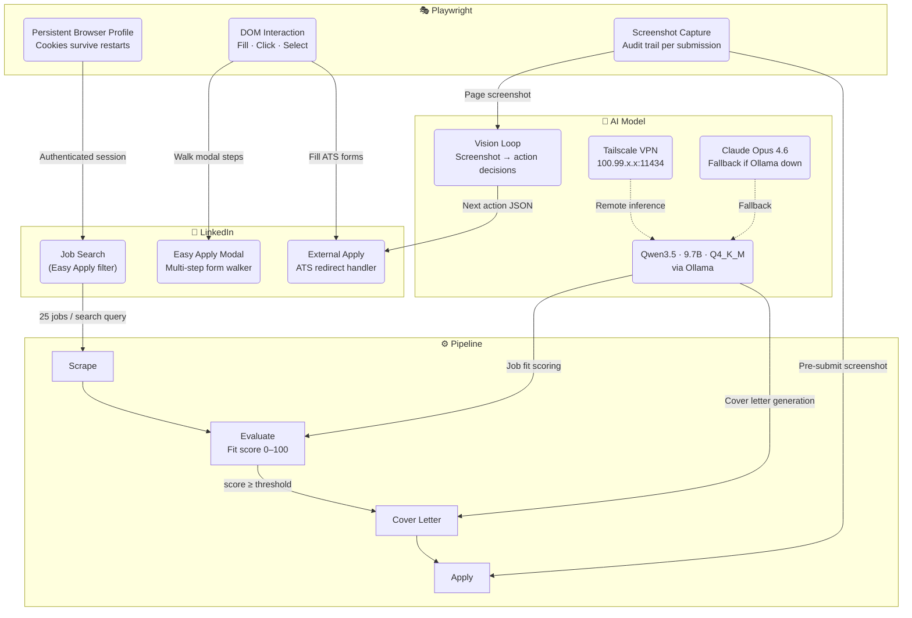

# Job Bot

Automated job scraping and application bot targeting LinkedIn Easy Apply and external ATS forms.

## Architecture



## Quick Start

```bash
cp .env.example .env          # add ANTHROPIC_API_KEY + LinkedIn credentials
pip install -e .
playwright install chromium
python cli.py login linkedin  # save browser session
python cli.py run --dry-run   # test without applying
python cli.py run             # live run
```

## Commands

| Command | Description |
|---|---|
| `python cli.py run` | Full pipeline: scrape → evaluate → apply |
| `python cli.py run --dry-run` | Preview only, no applications submitted |
| `python cli.py run --skip-scrape` | Apply to already-evaluated jobs in DB |
| `python cli.py run --non-easy-apply` | Include external ATS jobs |
| `python cli.py login linkedin` | Authenticate and save browser session |
| `python cli.py report` | Show application statistics |
| `python cli.py jobs` | List jobs in database |
| `python cli.py clear --all` | Wipe database |
